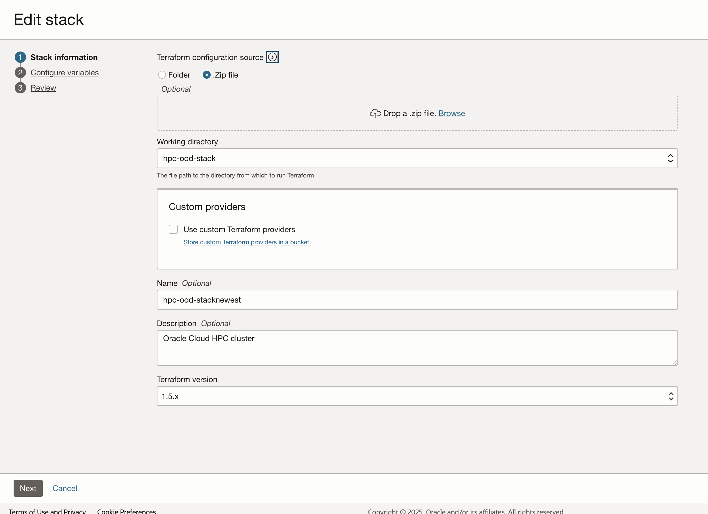
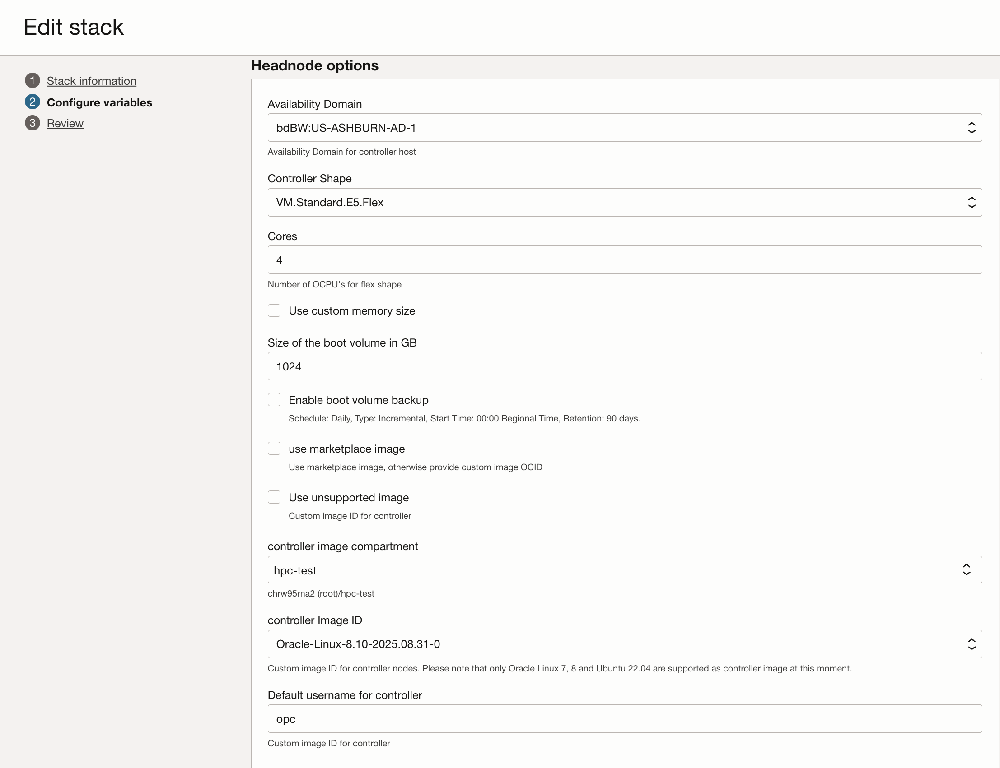
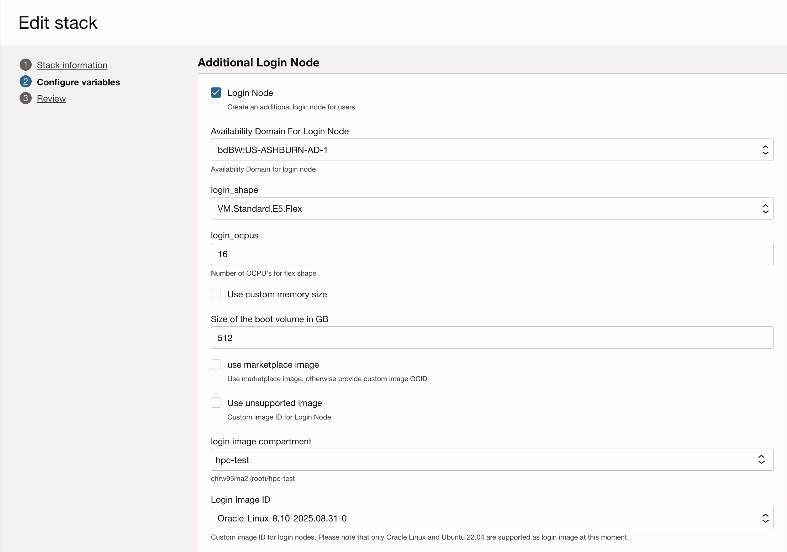
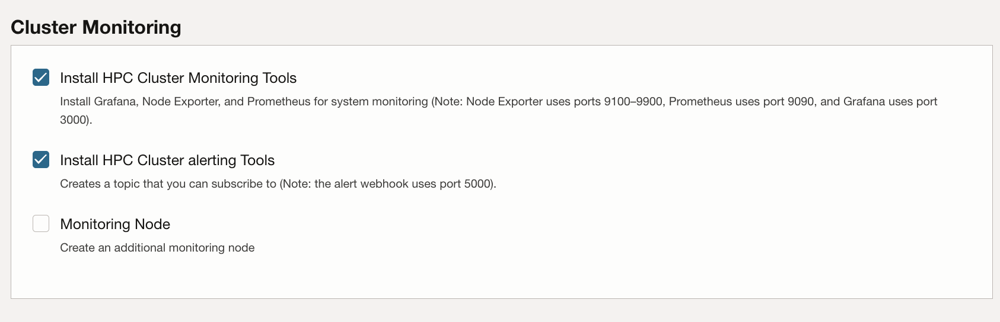
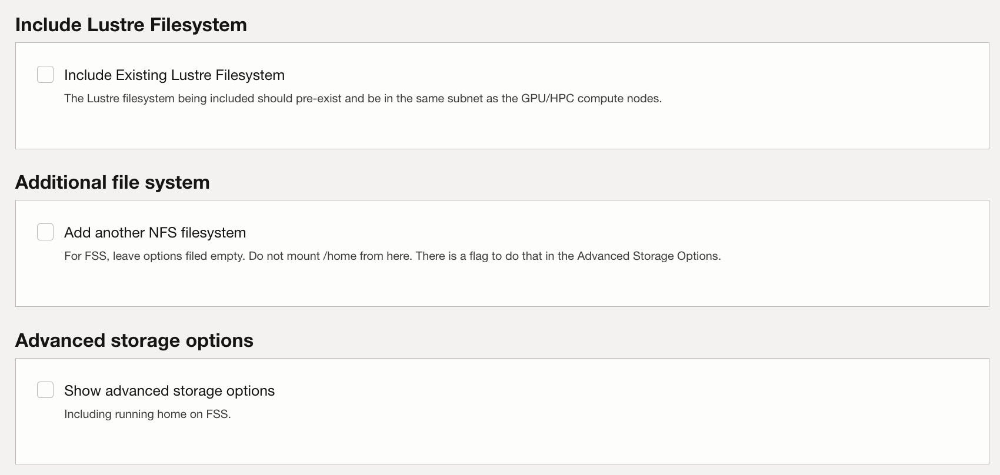
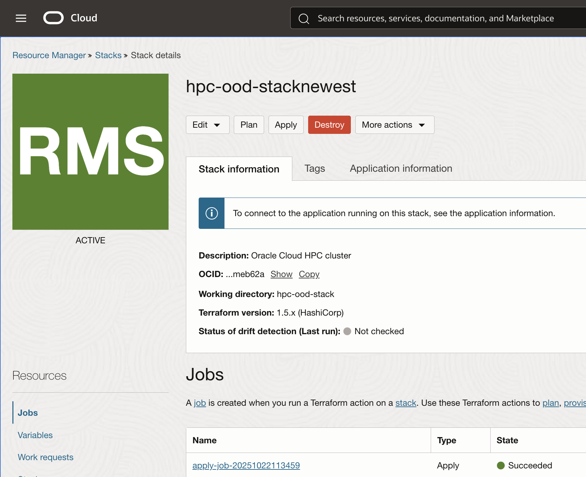

# Lab 1: Deploy the HPC Terraform Stack on OCI

## Introduction

In this lab you will a terraform stack using the resource manager on OCI. This by default will create a VCN, domain, compute VM components, and an optional cluster network. 

**Estimated Time:** 10 Minutes

Note: Deploying the terraform stack takes around 10 Minutes, However the actual infrastructure deployment takes around 40 min to complete.

### Prerequisites

It is assumed that you have access to or familiarity with following components:

- An Oracle account
- A compartment to deploy the solution in.
- Necessary user permissions to deploy and manage resources in your tenant.
- Familiarity with Oracle Cloud Infrastructure (OCI) components.
- How to download a folder from GitHub.

### Objectives

In this lab, you will;

- Download the terraform folder.
- Add the terraform stack using resource manager.
- Configure the variables for the terraform stack.
- Review the details and deploy the stack.

## Task 1: Download the terraform folder from Github

In order to deploy the terraform stack you need to download the folder with the terraform scripts from the OCI Github.

#### Follow the link below to go to the OCI GitHub page with the folder

link

 TODO

#### 2. Now select the folder and download it locally.

 TODO

## Task 2: Deploy the stack on OCI

#### 1. Now log in to your OCI console and select the hamburger dropodown menu.

Then use the search bar to look up "**Stacks**"

#### 2. Make sure you have the correct **compartment** selected then select "**Create stack**".

#### 3. Leave **My configuration** at the top selected and then drag and drop the terraform folder into the **Drop a folder section**.

When you have dropped the folder you can select **Next** at the bottom.

We now will begin to configure all the variables necessary to deploy the stack.

#### 4. Cluster configuration

- For this step make sure you select the desired compartment to store the stack.

- Next paste, select, or create a new desired ssh key.
		Make sure if you create a new key that you save the public and private copies locally for later.

	- **Use cluster name:**

		***Unselected***

	- **Configure LDAP authentication from controller:**

		***Enabled***

#### 5. Headnode Operation

- **Availibility Domain:**
	
	Choose any domain.

- **Controller Shape:**
		
	``BM.Optimizied3.36``.

- **Size of the boot volume in GB:**
  		
	Anything greater than 1TB.

- **Enable boot volume backup:**
  		
	***Unselected***

- **Use marketplace image:**
  		
	***Unselected***

-  **Use unsupported image:**
		
	***Unselected***

- **Controller image compartment:**
		
	Same as original compartment selected in previous step.

- **Controller Image ID:**
		
	``Oracle-Linux-8.10-2025.08.31-0`` or any similar release date.

- **Default username for controller:**

	You can leave this as opc.
	

### 6. Compute node options

- **Multiple ADs:**
	
	***Unselected***

- **Availability Domain:**
	
	Choose the same AD as your selected headnode.

- **Use cluster network:**

	***Enabled***

- **Use compute cluster rather than cluster network:**

	***Unselected***

- **Shape of the Compute Nodes:**

	``BM.Optimized3.36``

- **Initial cluster size:**

	You can change this if you like, in this lab we will use the default "2."

- **Hyperthreading enabled:**

	***Enabled***

- **Size of the boot volume in GB:**

	``500``

- **Use marketplace image:**

***Unselected***

- **Default username for compute hosts:**

	You can change this if you like, in this lab we will use the default "opc."

- **Use unsupported image:**

	***Unselected***

- **compute image compartment:**

	You can leave this as the same compartment as where your stack is deploying.

- **Image:**

	``Oracle-Linux-8.10-2025.08.31-0`` or any similar release date.

- **Modify BIOS options:**

	***Unselected***

- **Change hostname:**

	***Enabled***

	***Note: 
	You can change this if you like, in this lab we will use the default "GPUxx."***

### 7. Additional Login Node

- **Default username for login node:**

	**opc**
- **Additional block volume for login node:**

	**Unselected**

### 8. Cluster Monitoring

- **Install HPC Cluster Monitoring Tools:**

	***Enabled***

- **Install HPC Cluster alerting Tools:**

	***Enabled***

- **Monitoring Node:**

	***Unselected***

### 9. Autoscaling

- **Scheduler based autoscaling:**

	***Unselected***

- **RDMA Latency check:**

	***Enabled***

### 10. API authentication, needed for autoscaling

### 11. File systems

You can leave all the options: ***Unselected***

### 12. Network options

You can choose to create a new VCN with this stack (Recommended).

You don't need to make any changes to the default network.

You can also choose to re-use another VCN.

`Warning: Not all VCN configurations will be compatible with the stack. This may cause the stack to fail deployment.`

### 13. Software

- **Sudo Access:**

	***Enabled***

- **Name of the group with privileges:**

	This can be whatever you like.

- **Install SLURM:**

	***Enabled***

- **Create a back-up Slurm Controller:**

	***Unselected***

- **Create Rack aware topology:**

	***Enabled***

- **Queue Name:**

	This can be whatever you like.

- ***Install Spack package manager:***

	***Enabled***

- **Install Nvidia Enroot for containerized GPU workloads:**

	***Enabled***

- **Install Nvidia Pyxis plugin for Slurm:**

	***Enabled***

- **Enable PAM:**

	***Unselected***

- **Enable Limits for Slurm jobs:**

	***Unselected***

- **Turn on Healthchecks for GPU nodes:**

	***Enabled***

### 14. Debug and other settings

- Debug

	***Enabled***

- Active

	***Enabled***

- allowed_grants

	``authorization_code``,
	``client_credentials``

- client_ip_checking

	``anywhere``

- client_type

	``confidential``

- csr_access

	``none``

- existing_domain_ocid

	ocid1.domain.oc1..aaaaaaaanmildwwcqkjeagqpbm6eigyu6o57b6wifdbfnz2a3pygirrbc2gq

- force_delete

	***Unselected***

- influxdb

	***Enabled***

- is_oauth_client

	***Enabled***

- ood_display_name

		``od_app``

- ood_schemas

	``urn:ietf:params:scim:schemas:oracle:idcs:App``

- ood_user_email

	Input your email.

- ood_user_password

	Choose a password.

- ood_username		

	``ood_user``

- schemas

	``urn:ietf:params:scim:schemas:oracle:idcs:Settings``

- setting_id

	``Settings``

- show_in_my_apps

	***Enabled***

- timezone

	Whatever you prefer. You can leave as default.

- use_existing_idcs

	Choose whether to use an existing IDCS domain (true) or create a new one (false).

	In this lab we will create a new one.

- user_schemas

	``urn:ietf:params:scim:schemas:core:2.0:User``

	Once you complete this step you can click next at the bottom.

 
### 15. Final Step

Once you complete the prevous step and click next you hould see the review screen.

If all the information looks correct you can scroll all the way to the bottom and enable the run apply option.

This will automatically deploy your stack right away.

Now click "**Save Changes**" at the bottom and wait for your new HPC stack to deploy.

If your deployment is successful you should see the RMJ (Resource Manager Job) tile turn green.

If you click on stack details at the top you will also see a confirmation that your stack successfully deployed and that all of your resources are created.

## Lab Completed

Congratulations! You have completed your deployment of the HPC terraform stack.

If you encounter a failure make sure you first destroy the stack before you delete anyting.

If you do not destroy the stack before redeploying, or deleting the stack, you may encounter some issues.

You may proceed to the next lab, where you will log into the stack manager.

## Learn More

## Acknowledgements

* **Author:** Chris Wegenek
, Cloud Engineering 
* **Contributors:**
    - Germain Vargas, Cloud Engineering

* **Last Updated By/Date:** Chris Wegenek
, Cloud Engineering, November 2025