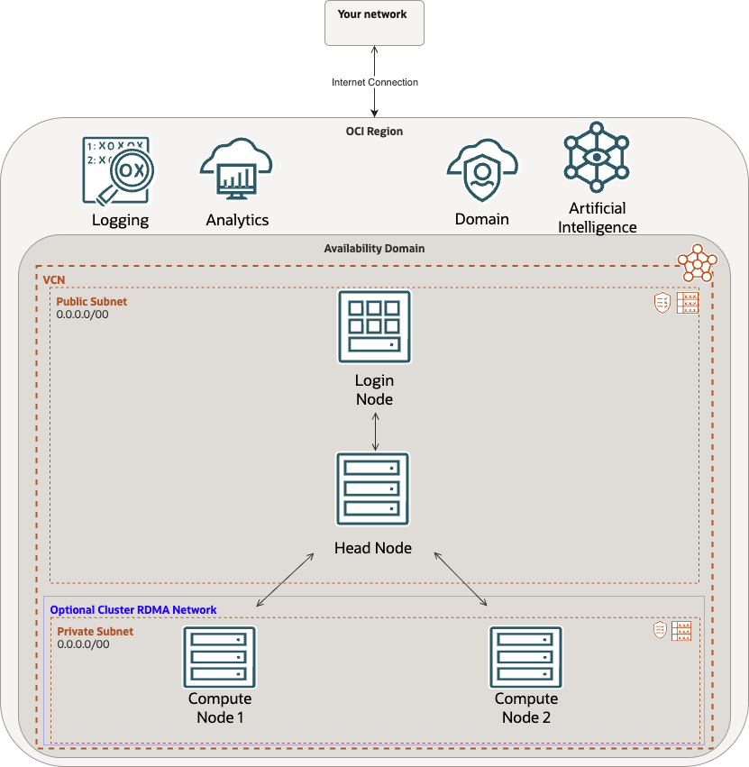

# How to deploy and HPC cluster on OCI using a terraform Stack.

**Estimated time:** 2 Hours

## Workshop Introduction

The workshop will showcase how to deploy a Oracle Cloud HPC stack in an OCI tenancy and how to log into the cluster, check metrics, and destroy the stack when you are done.

We will cover following topics as part of the upcoming labs.

- HPC stack prerequisites
- Deploying the stack on OCI using terraform
- Accessing the cluster
- Accessing grafana
- Viewing metrics for the cluster
- Destroying the stack

## Architecture

As part of the workshop, we will be deploying a terraform script that utilizes a VCN, a domain, and the cluster. The total number of VMs in the cluster can vary due to input criteria. The following image showcases the logical architecture of the target lab.

### Prerequisites

The lab makes following assumptions:

- Familiarity with Oracle Cloud
- An Oracle Cloud Account
- A paid tenancy 
- Familiarity with OCI components and features
-Ability to download a file from GitHub

## Learn More

* [Oracle Cloud](https://www.oracle.com/cloud/)
* [Oracle Cloud VMware Solution Overview](https://www.oracle.com/in/cloud/compute/vmware/)
* [OCVS Documentation](https://docs.oracle.com/en-us/iaas/Content/VMware/Concepts/ocvsoverview.htm)

## Acknowledgements

* **Author:** Chris Wegenek, Cloud Engineering
* **Contributors:**
    - Germain Vargas, Cloud Engineering
    - Rafael Marcelino Koike, Cloud Engineering

* **Last Updated By/Date:** Chris Wegenek, Cloud Engineering February 2025